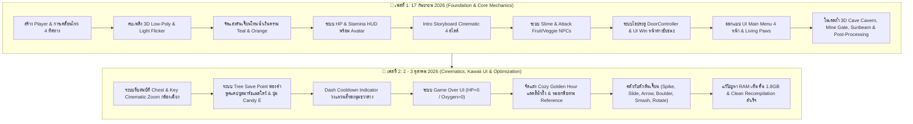

# ⚔️ ROOTBOUND GUARDIAN — MASTER PROJECT DEV LOG & CHRONOLOGICAL TIMELINE
> **เอกสารบันทึกประวัติการพัฒนา สถาปัตยกรรมระบบ ฟีเจอร์ และ Asset ทั้งหมดในโปรเจกต์**  
> **รวมรวมเอกสาร:** `project_status.md` (17 ก.ย. 2026) + `SAVE.md` (2-3 ต.ค. 2026) เรียงลำดับตามระยะเวลาพัฒนา  
> **สถานะปัจจุบัน:** คอมไพล์ผ่าน 100% (`errorCount: 0`, `scriptCompilationFailed: False`) พร้อมทดสอบใน Unity Editor

---

## 📌 1. ข้อมูลภาพรวมโปรเจกต์ (Project Overview)

- **ชื่อโปรเจกต์:** Rootbound Guardian
- **ที่ตั้งโฟลเดอร์หลัก:** `C:\Users\Artemis\rootbound-guardian`
- **Unity Version:** Unity 6000.3.9f1 (Unity 6 / 6000.3 Staging Branch)
- **Render Pipeline:** Universal Render Pipeline (URP)
- **สเปกเครื่องรัน:** Windows 11 Pro 64-bit, RAM 32 GB
- **แนวเกม:** 3D Action RPG / Cozy-Atmospheric Dungeon Crawler

---

## ⏳ 2. ลำดับไทม์ไลน์การพัฒนา (Chronological Development Timeline)

---

## 🗺️ 3. แผนผังฉากทั้งหมดในโปรเจกต์ (Scene Hierarchy)

| ลำดับ | ซีน (Scene Path) | บทบาทและรายละเอียด |
| :--- | :--- | :--- |
| **01** | `Assets/Scenes/MainScreen.unity` | **หน้าแรกของเกม (Title & Main Menu)**: ถ้ำหิน 3D สไตล์ Stylized พร้อมแสงแดดเพดาน (Sunbeam), โคมไฟเรืองแสง, บันไดหินปูมอสส์, รั้วไม้, ขวานขุดเหมือง และเมนู UI 4 หน้า |
| **02** | `Assets/Scenes/IntroScene.unity` | **คัตซีนเปิดเนื้อเรื่อง (Narrative Storyboard)**: สไลด์เล่าเรื่อง 4 ฉากพร้อมเอฟเฟกต์พิมพ์ดีดและละอองฝุ่นทอง (Dust Motes) |
| **03** | `Assets/Scenes/LevelDesign 1.unity` | **ด่านดันเจี้ยนหลัก Tier 1**: บรรยากาศ Cozy Fairytale ตะลุยด่านกับดัก เควสต์หากุญแจ และเปิดหีบสมบัติ |
| **04** | `Assets/Scenes/LevelDesign 2.unity` | **ด่านดันเจี้ยน Tier 2**: ขยายขอบเขตแผนที่ ทางเดินปริศนา และปริมาณกับดักที่เข้มข้นขึ้น |
| **05** | `Assets/Scenes/NutTest.unity` / `NutScene.unity` | **ห้องทดสอบฟิสิกส์ ระบบการเคลื่อนไหว และ AI ตัวละคร** |
| **06** | `Assets/Scenes/oilTrapTest.unity` | **ห้องทดสอบกับดักน้ำมันและการตอบสนองต่อสิ่งกีดขวาง** |
| **07** | `Assets/Scenes/Loading Screen.unity` | **หน้าจอโหลดฉากแบบ Smooth Asynchronous Transition (หน่วง 5.5 วินาที)** |
| **08** | `Assets/Scenes/UI Win.unity` | **หน้าสรุปผลชัยชนะ (Victory Screen)**: แสดงเวลาที่ใช้, HP คงเหลือ และปุ่ม Replay / Main Menu |

---

## 📅 4. บันทึกการพัฒนา เฟสที่ 1 (17 กันยายน 2026)
> *เนื้อหาจากเอกสารดั้งเดิม `project_status.md`*

### 4.1 งานสนับสนุนและสคริปต์ภายนอก
- **[program.py](file:///C:/Users/Artemis/Downloads/program.py)**: สคริปต์วาดรูปดาวทรงนาฬิกาทรายและแสดงชื่อผู้ใช้ พร้อมระบบรอกดปุ่มเพื่อปิดหน้าต่างคอนโซล
- **[screenshot.png](file:///C:/Users/Artemis/Downloads/screenshot.png)**: ภาพแคปหน้าจอผลลัพธ์ผ่านคอมมานด์ไลน์ด้วยฟอนต์ Consolas
- **[Movie_001.mp4](file:///C:/Users/Artemis/Downloads/Movie_001.mp4)**: บีบอัดไฟล์วิดีโอบันทึกตัวเกมจาก `24.50 MB` ลดลงเหลือ `2.07 MB` (ลดขนาด 91% โดยคุณภาพยังคมชัด)

### 4.2 ตัวละคร การเคลื่อนไหว และ HUD เริ่มต้น
- **[Player.prefab](file:///C:/Users/Artemis/rootbound-guardian/Assets/Prefabs/Player.prefab)**: จัดการสไปรต์ตัวละครหลัก คลีนสคริปต์คอมไพล์เสียออกทั้งหมด
- **[PlayerMovement.cs](file:///C:/Users/Artemis/rootbound-guardian/Assets/Scripts/Player/PlayerMovement.cs)**: เขียนระบบเดิน 4 ทิศทาง (W/A/S/D) พร้อมสลับอนิเมชั่นทิศทางอย่างเหมาะสม
- **[HUD_Canvas.prefab](file:///C:/Users/Artemis/rootbound-guardian/Assets/Prefabs/HUD_Canvas.prefab)**: UI หน้าจอหลอดเลือดสีเขียวใบไม้ (HP) และหลอดพลังงานสีเหลืองสายฟ้า (Stamina) ล้อมรอบด้วยกรอบไม้ธรรมชาติ
- **[HUD_Avatar_Portrait.png](file:///C:/Users/Artemis/rootbound-guardian/Assets/Image/HUD_Avatar_Portrait.png)**: นำภาพใบหน้าตัวละครเด็กผู้หญิงเอลฟ์ผมแดงตัวจริงจาก `WalkDown01.png` มาตัดสัดส่วน 1:1 ใส่ในกรอบไม้วงกลม

### 4.3 โมเดลคบเพลิง 3D และการจัดแสงดันเจี้ยน
- **[Torch.prefab](file:///C:/Users/Artemis/rootbound-guardian/Assets/Prefabs/Torch.prefab)**: คบเพลิงสไตล์เหลี่ยม (Low-Poly) พร้อมคอลไลเดอร์ แสงสว่างส้ม และเอฟเฟกต์ควันไฟกะพริบ
- **[LightFlicker.cs](file:///C:/Users/Artemis/rootbound-guardian/Assets/Scripts/LightFlicker.cs)**: สคริปต์สั่นพิกัดแสงไฟและหรี่กะพริบตามลมอย่างเป็นธรรมชาติ
- **[AdditiveParticles.shader](file:///C:/Users/Artemis/rootbound-guardian/Assets/Shaders/AdditiveParticles.shader)**: แก้ไขบั๊กคบเพลิงแสดงผลสีม่วง (Shader Error) โดยใส่ Custom Shader แทน URP built-in shader
- **เมนูจัดแสงอัตโนมัติ (`DungeonSceneConfigurator.cs`):** เมนู `Tools ➡️ SproutScout ➡️ Configure Dungeon Lighting and Post-Processing`
  - ปรับ Directional Light เป็นสีน้ำเงินมืดสไตล์ดันเจี้ยนใต้ดิน วางไฟกะพริบ 5 จุดใน `map.unity`
  - เปิด Post-Processing: **Vignette**, **Bloom**, และ **Color Grading สไตล์ Teal & Orange**

### 4.4 คัตซีนเนื้อเรื่องเปิดเกม (Intro Storytelling Cinematic)
- **[Intro_Cinematic_Canvas.prefab](file:///C:/Users/Artemis/rootbound-guardian/Assets/Prefabs/Intro_Cinematic_Canvas.prefab)**: สไลด์ภาพวาด 4 ฉาก (อธิษฐาน ➡️ ดาวตก ➡️ ภูตแห่งแสงปรากฏ ➡️ ภูตชี้ทางเข้าดันเจี้ยน)
- **[IntroCinematicManager.cs](file:///C:/Users/Artemis/rootbound-guardian/Assets/Scripts/Intro/IntroCinematicManager.cs)**: คุมพิมพ์ดีดทีละตัวอักษร, เฟดฉากเมื่อกด Space หรือคลิก และโหลดไปซีนเล่นเกมเมื่อจบ
- **การจัดฉากฝุ่นละออง:** เมนู `Tools ➡️ SproutScout ➡️ Setup Intro Scene with Dustmotes` วางละอองฝุ่นสีทองติดหน้ากล้อง

### 4.5 หน้าจอโหลดฉากและระบบ NPC
- **[Loading Screen.cs](file:///C:/Users/Artemis/rootbound-guardian/Assets/Scripts/Loading%20Screen.cs)**: หน่วงเวลาโหลดขั้นต่ำ `5.5 วินาที` เพื่อให้แถบเปอร์เซ็นต์วิ่งเต็ม 100% แล้วสลับเข้าซีนถัดไปอย่างนุ่มนวล
- **[SlimeV2NPC.cs](file:///C:/Users/Artemis/rootbound-guardian/Assets/Scripts/SlimeV2NPC.cs)**: สไลม์กระโดดฟิสิกส์ 3D มียืด-หด (Squash & Stretch) พร้อมกล่องข้อความ Billboard เหนือหัว
- **[CreateAttackNPCs.cs](file:///C:/Users/Artemis/rootbound-guardian/Assets/Scripts/Editor/CreateAttackNPCs.cs)**: มอนสเตอร์สายจู่โจม 5 ตัว (Tomato 1-3, Carrot, Bean) พร้อมบทพูดประจำสายพันธุ์
- **[ConfigureSpritesLighting.cs](file:///C:/Users/Artemis/rootbound-guardian/Assets/Scripts/Editor/ConfigureSpritesLighting.cs)**: อัปเดตสไปรต์ 2D ทั้งหมดให้ใช้ URP Lit พร้อมเปิดเงาสองด้าน (Two-Sided Shadows)
- **[CreateRockPrefab.cs](file:///C:/Users/Artemis/rootbound-guardian/Assets/Scripts/Editor/CreateRockPrefab.cs)**: สร้างโมเดลหิน 3D Low-Poly พร้อมเท็กซ์เจอร์และ Prefab หินอัตโนมัติ

### 4.6 ระบบประตูไขกุญแจและหน้าจอชัยชนะ (Victory & Door Unlock)
- **[WinUIManager.cs](file:///C:/Users/Artemis/rootbound-guardian/Assets/Scripts/Player/WinUIManager.cs)**: แสดงหน้าต่างฉลองชัยเมื่อไขประตูผ่านด่าน คำนวณ Clear Time, แสดง HP คงเหลือ และเล่นคอร์ดเสียง Arpeggio ชัยชนะ
- **[DoorController.cs](file:///C:/Users/Artemis/rootbound-guardian/Assets/Scripts/Player/DoorController.cs)**: ปรับปรุงการตรวจจับ Player ทั้ง Parent/Child, รองรับทั้ง Trigger & ชนบานประตู, ป้าย Billboard ลอยแจ้งเตือน, และสั่งสวิงเปิด 90°
- **[QuestManager.cs](file:///C:/Users/Artemis/rootbound-guardian/Assets/Scripts/Player/QuestManager.cs)**: อัปเดตข้อความภารกิจเป็นสีทองอร่ามเมื่อไขประตูสำเร็จ

### 4.7 ระบบ UI หน้าจอเริ่มเกม และฉากหลัง 3D (Main Menu System & Cave Environment)
- **[MainMenuUIController.cs](file:///C:/Users/Artemis/rootbound-guardian/Assets/Scripts/UI/MainMenuUIController.cs)**: เมนู 4 หน้า (Press Any Key, Main Menu, Settings, Exit Modal)
- **[PawPairSync.cs](file:///C:/Users/Artemis/rootbound-guardian/Assets/Scripts/UI/PawPairSync.cs)**: ไอคอนอุ้งเท้าแมวลอยดุ๊กดิ๊กประกบปุ่ม
- **[SetupMainScreenEnvironment.cs](file:///C:/Users/Artemis/rootbound-guardian/Assets/Scripts/Editor/SetupMainScreenEnvironment.cs)**: สร้างถ้ำ 3D ซุ้มประตูไม้ บันไดหินมอสส์ รั้วไม้ ขวานขุดเหมือง โคมไฟ และลำแสงแดด Sunbeam
- **การแก้ไข Shadow Atlas & Volume Override:** แก้ปัญหา Point Light กิน Shadow Maps เกิน 2048x2048 โดยปิดเงาที่ Point Light และเปิด Soft Shadows คมชัดเฉพาะ Sun Shaft พร้อมล็อกสคริปต์ไม่ให้ Override Volume ทับขณะเล่น

---

## 📅 5. บันทึกการพัฒนา เฟสที่ 2 (2 - 3 ตุลาคม 2026)
> *เนื้อหาจากเอกสารล่าสุด `SAVE.md`*

### 5.1 ระบบคัตซีนเปิดหีบสมบัติ (`ChestController.cs`)
- **การตรวจจับ:** ผู้เล่นเข้าใกล้ในระยะ `3.5m` แสดง UI แจ้งเตือน
- **ลำดับคัตซีน:**
  - ฝาหีบเปิดอ้าออกทำมุม `-85°`
  - แสงออร่าและละออง Radiant Burst VFX สว่างวาบขึ้นพร้อมเสียง Fanfare
  - กุญแจเวทมนตร์ลอยขึ้นและหมุนรอบตัวเอง
  - กล้องหลักตัดเข้าสู่ **Cinematic Close-Up Zoom** โฟกัสกุญแจโดยตรงจากมุมเฉียงด้านหน้า
- **ค่าพารามิเตอร์ที่ปรับแต่งสมดุลล่าสุด:**
  - `keyRiseHeight`: **`0.42f`** (ปรับแก้ไม่ให้ลอยสูงเกินไป อยู่ในระดับพอดีเหนือขอบหีบ)
  - `keyTargetScale`: `Vector3(0.24f, 0.24f, 0.24f)` (สเกลกุญแจสมส่วนคมชัด)
  - `camCloseUpWorldPos`: ตำแหน่งเยื้อง `Vector3(0.45f, 0.35f, -1.9f)` หลบมุมหลังตัวละคร ไม่โดนบัง 100%

### 5.2 จุดเซฟต้นไม้และ Kawaii UI Suite (`TreeSavePoint.cs`, `TreeInteractUI.cs`)
- **ดีไซน์น่ารักแบบมาร์ชแมลโลว์ (Marshmallow & Candy Style):**
  - **Speech Bubble Capsule (`Cute_Tree_Bubble_Bg.png`)**: กล่องแคปซูลฟองคำพูดทรงมน สีครีมละมุน ขอบเขียวพาสเทล พร้อมหางชี้หาต้นไม้
  - **Candy 3D [E] Keycap (`Cute_Key_E_Candy.png`)**: ปุ่มคีย์บอร์ด 3D สไตล์ลูกกวาดเยลลี่สีเนยทอง ตัวอักษร E นูนหนากลมมน
  - **Cute Sprout Badge (`Cute_Sprout_Badge.png`)**: ไอคอนต้นกล้าใบไม้จิ๋ว 🌱 สองใบพร้อมประกายดาวสีทองวิ้งวับ
  - **Typography**: ข้อความ `"REST & SAVE"` สไตล์ลายมือแฟนตาซี **`OneLittleFont-Full SDF`** สีเขียวมอสส์เข้ม
- **พฤติกรรมแอนิเมชันร่าเริง:**
  - **Floating & Wobble**: ลอยขึ้น-ลงพร้อมเอียงส่ายเบาๆ ±2.4°
  - **Squash & Stretch Breathing**: จังหวะยุบพองแบบหายใจ
  - **Key Hop**: ปุ่ม [E] กระโดดดึ๋งทุก 1.4 วินาทีเรียกร้องความสนใจ
  - **Elastic Overshoot Pop-In**: ขยายตัวเด้งออกแบบสปริงเมื่อผู้เล่นเดินเข้าใกล้
- **VFX และการฟื้นฟู:**
  - ละอองใบไม้สีเขียวทอง (`RisingLeaves`) พุ่งกระจาย
  - ประกายดาวเวทมนตร์ (`Sparkles`) และวงแหวน Shockwave สีเทอร์ควอยซ์
  - หิ่งห้อยเรืองแสง (`AmbientFireflies`) บินวนรอบต้นไม้
  - เติมเต็มค่า HP และ Oxygen ให้แก่ผู้เล่นจนเต็ม 100%

### 5.3 ระบบผู้เล่น เอาชีวิตรอด และ Dash Indicator HUD
- **หลอดพลังชีวิตและออกซิเจน (`PlayerHealth.cs`, `PlayerOxygen.cs`):** อัปเดตแบบเรียลไทม์ ลดลงเมื่อโดนพิษ ติดกับดัก หรือขาดอากาศ
- **Dash Cooldown Ring Indicator (มุมขวาล่าง):**
  - กรอบวงแหวนสีทองหรูหรา (`Dash_Ring.png`)
  - หน้ากากเรเดียลฟิลล์หมุนนับถอยหลังคูลดาวน์ (`Dash_Cooldown_Mask.png`)
  - ไอคอนปีกแสงสีฟ้าพุ่งทะยาน (`Dash_Icon.png`) แสดงสถานะพร้อมใช้งาน
- **Quest Tracker Banner UI:** แถบป้ายไม้แฟนตาซีกรอบทองแสดงเป้าหมายภารกิจชัดเจน
- **Game Over UI (`GameOverUIManager.cs`):** ทำงานอัตโนมัติเมื่อ HP หรือ Oxygen = 0 ล็อกการบังคับ และแสดงหน้าต่าง Retry / Reload จุดเซฟ

### 5.4 คลังกับดักดันเจี้ยน (Traps & Hazards Suite)
ชุดสคริปต์กับดักใน `Assets/Scripts/Trap/`:
1. **Spike Trap (`SpikeTrapBase.cs`)**: หนามแหลมแทงจากพื้นตามรอบเวลา
2. **Sliding Trap (`SlidingTrap.cs`)**: บล็อกหิน/ใบมีดเลื่อนขวางทางเดิน
3. **Arrow Trap & Projectiles (`ArrowTrap.cs`, `ArrowProjectile.cs`)**: แท่นยิงลูกศรจากผนังเมื่อเหยียบแผ่นสวิตช์
4. **Boulder Trap & Spawner (`BoulderTrap.cs`, `BoulderSpawner.cs`)**: หินกลิ้งยักษ์ตามทางลาด
5. **Automatic Smash Trap (`AutomaticSmashTrap.cs`)**: เสาหินทุบกระแทกจากเพดาน
6. **Rotating Obstacle (`RotateObject.cs`)**: ท่อนซุง/ใบมีดหมุนเหวี่ยงรอบแกน

### 5.5 การจัดแสง Cozy Golden Hour & Post-Processing (Fairytale Reference)
- **Directional Sunlight:** สี Warm Sunny Honey Gold (`#FFF0CC`), Intensity `1.45f`, องศา `(34f, -145f, 0f)`, Soft Shadows `0.60f` โปร่งสบายตา
- **Trilight Ambient:** Sky = Warm Peach, Equator = Golden Sage, Ground = Warm Sand/Moss
- **Fog & Skybox:** `WarmGoldenSkybox.mat` สีพีชทอง, Linear Fog สี Warm Peach Mist (`#F6D6A6`) ระยะ 18m - 75m
- **Lanterns & Torches:** แสงสีส้มอำพัน (`Color(1.0f, 0.74f, 0.35f)`) ส่องเป็นจุดๆ
- **URP Post-Processing:** White Balance Temp `+14`, Saturation `+18`, Bloom ฟุ้งนวลตา (`Intensity 0.85`), Vignette จางๆ `0.15`

### 5.6 การแก้ไขปัญหาเสถียรภาพและหน่วยความจำ (RAM & Build Cache Fix)
- **ปัญหา:** RAM เครื่องเต็ม ทำให้ Process `AssetImportWorker42`, `AssetImportWorker43` ค้างกลายเป็น Zombie Process ส่งผลให้ `scriptCompilationFailed = True` ค้างในระบบ
- **การแก้ไข:** ปิด Worker ค้าง คืน RAM ~1.8GB และสั่ง `CompilationPipeline.RequestScriptCompilation(RequestScriptCompilationOptions.CleanBuildCache)`
- **ผลลัพธ์:** ปัจจุบันโปรเจกต์คอมไพล์ผ่านสมบูรณ์ `errorCount: 0`, `scriptCompilationFailed: False` 100%

---

## 🕹️ 6. ขั้นตอนการทดสอบใน Unity Editor (Testing Workflow)

1. **ทดสอบระบบไตเติลและเมนูหลัก:**
   - เปิดซีน `Assets/Scenes/MainScreen.unity` ➡️ กด **Play**
   - หน้าแรกกดคีย์ใดๆ เพื่อเข้าเมนูหลัก
   - ขยับเมาส์ดูอุ้งเท้าแมวขยับดุ๊กดิ๊กตามปุ่ม `START`, `SETTINGS`, `EXIT`
   - เข้าหน้า `SETTINGS` เลื่อนแถบเสียงดูการตอบสนองของลูกศร ◀ ▶
   - กดปุ่ม `EXIT` ตรวจสอบ Modal ยืนยันออกจากเกม
2. **ทดสอบเกมเพลย์และการสำรวจ:**
   - เปิดซีน `Assets/Scenes/LevelDesign 1.unity` (หรือรันต่อจาก IntroScene)
   - เดินไปที่ **ต้นไม้เซฟพอยต์**: สังเกต UI แคปซูลมาร์ชแมลโลว์และปุ่ม [E] กระโดดดึ๋ง กด [E] เพื่อดูเอฟเฟกต์ใบไม้ปลิวและฟื้นฟูเลือด/ออกซิเจน
   - เดินไปที่ **หีบสมบัติ**: กด [E] เพื่อดูคัตซีนเปิดหีบ กุญแจลอยตัวสง่า และกล้องซูมเข้าหากุญแจโดยไม่โดนตัวละครบัง
   - เดินหลบหลีกกับดักหนาม ลูกศร และเสาทุบ
   - ทดสอบการกด Dash (Space/Shift) และสังเกตวงแหวนคูลดาวน์หมุนนับถอยหลังที่มุมขวาล่าง
   - นำกุญแจไปไขประตูดันเจี้ยนเพื่อเข้าสู่หน้าสรุปผลชัยชนะ Victory Screen
